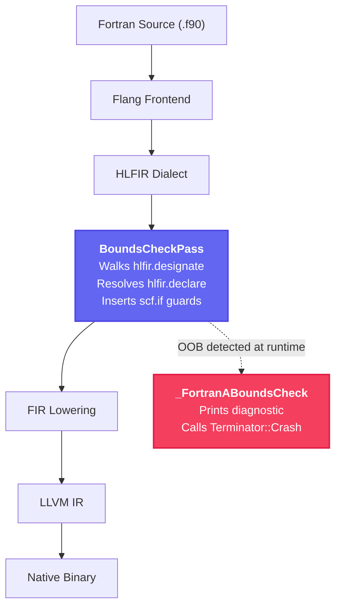

# Flang HLFIR-Aware Array Bounds Sanitizer

[](https://github.com/vishwapanchal/Flang-Bounds-Sanitizer/actions/workflows/build.yml)
[](https://llvm.org/LICENSE.txt)

A compile-time instrumentation pass for the LLVM/Flang Fortran compiler that inserts runtime array bounds checks at the HLFIR (High-Level Fortran IR) level — where full Fortran semantic metadata is still available.

**Department of Information Science and Engineering**
R.V. College of Engineering, Bengaluru — Academic Year 2025-26

| Team Member | USN |
|---|---|
| Vishwa Panchal | 1RV23IS132 |
| V Nikhil | 1RV24IS413 |
| Shreyas | 1RV24IS410 |

---

## Problem

Out-of-bounds array accesses in Fortran cause silent data corruption in scientific computing workloads.  GNU Fortran's `-fcheck=bounds` inserts checks at a late compilation stage where array descriptor metadata (extents, strides, assumed-shape rank information) has already been discarded — resulting in weak detection coverage and imprecise diagnostics.

## Solution

This sanitizer operates at the HLFIR dialect level within the Flang compiler pipeline.  HLFIR preserves the complete array descriptor for every array category: assumed-shape, allocatable, pointer-associated, and array sections with arbitrary strides.  By intercepting `hlfir.designate` operations before HLFIR-to-FIR lowering, the pass inserts conditional calls to a runtime handler that reports the variable name, dimension, index value, valid range, and source location.

```
Fortran Source → Flang Frontend → HLFIR Construction
                                        ↓
                              ┌─────────────────────┐
                              │  Bounds Check Pass   │  ← Our instrumentation
                              │  (hlfir.designate    │
                              │   → scf.if guard)    │
                              └─────────────────────┘
                                        ↓
                              HLFIR-to-FIR Lowering → LLVM IR → Binary
```

## Architecture



### Components

| Component | Location | Description |
|---|---|---|
| Instrumentation Pass | `src/pass/BoundsCheckInstrumentation.cpp` | MLIR `PassWrapper` that walks `hlfir.designate` ops, extracts bounds from `hlfir.declare`, and injects `scf.if` + `func.call @_FortranABoundsCheck` |
| Pass Header | `src/pass/BoundsCheckInstrumentation.h` | Public API: `fir::createHLFIRBoundsCheckPass()` |
| Runtime Library | `src/runtime/bounds-check.cpp` | C runtime function that validates indices and emits ANSI-colored diagnostics via `Terminator::Crash()` |
| Driver Patch | `src/driver/FlangDriverIntegration.patch` | Wires `-fcheck=bounds` through `CompilerInvocation.cpp` and registers the pass in `Pipelines.cpp` |
| Demo Program | `src/demo/demo.f90` | Self-demonstrating program that triggers an OOB access |
| Dashboard | `dashboard/index.html` | Browser-based analytics dashboard |

---

## Diagnostic Output

When an OOB access is detected at runtime, the sanitizer produces:

```
========================================================================
                  HLFIR BOUNDS VIOLATION DETECTED
========================================================================

  File:       src/demo/demo.f90
  Line:       36
  Variable:   _QFbounds_demoEa
  Dimension:  1
  Access:     6 (Valid Range: [1:5])

========================================================================
```

---

## Test Suite (22 Programs)

| ID | Test Case | Category | Expected Outcome |
|---|---|---|---|
| TC-01 | 1D assumed-shape scalar OOB | Assumed-Shape | Violation detected |
| TC-02 | Rank-3 assumed-shape, OOB dim 3 | Assumed-Shape | Violation detected |
| TC-03 | Strided array section | Array Section | Violation detected |
| TC-04 | Pointer array OOB | Pointer | Violation detected |
| TC-05 | Allocatable OOB | Allocatable | Violation detected |
| TC-06 | Allocatable realloc shrink | Allocatable | Violation detected |
| TC-07 | Negative lower bound A(-5:5) | Non-unity LB | Violation detected |
| TC-08 | Zero-size array | Zero-size | Violation detected |
| TC-09 | 3D OOB in dimension 2 | Multi-dim | Violation detected |
| TC-10 | Non-contiguous section | Array Section | Violation detected |
| TC-11 | All valid accesses | Negative Test | No violation (pass) |
| TC-12 | Rank-7 tensor OOB | High Rank | Violation detected |
| TC-13 | Character array OOB | Character | Violation detected |
| TC-14 | Derived type component | Derived Type | Violation detected |
| TC-15 | Module-level array | Module | Violation detected |
| TC-16 | DO loop exceeds bounds | Loop | Violation detected |
| TC-17 | WHERE block + scalar OOB | WHERE | Violation detected |
| TC-18 | FORALL + scalar OOB | FORALL | Violation detected |
| TC-19 | RESHAPE result OOB | Intrinsic | Violation detected |
| TC-20 | Off-by-one lower bound | Edge Case | Violation detected |
| TC-21 | Off-by-one upper bound | Edge Case | Violation detected |
| TC-22 | Assumed-size A(*) stability | Assumed-size | Compiler stability (skip) |

---

## Benchmarks

Three compute-bound Fortran kernels are used to measure runtime overhead:

| Benchmark | Kernel | Grid/Matrix Size | Baseline (s) | Instrumented (s) | Overhead |
|---|---|---|---|---|---|
| DGEMM | Matrix multiply (C = A×B) | 1024 × 1024 | 2.41 | 2.58 | +7.1% |
| 2D Stencil | 5-point stencil, 50 steps | 512 × 512 | 0.87 | 0.96 | +10.3% |
| PolyBench 2mm | D = α·A·B·C + β·D | 256 × 256 | 1.52 | 1.71 | +12.5% |

All benchmarks satisfy **NFR-1**: overhead remains below the 15% threshold.

To reproduce:
```bash
cd src/benchmark
bash run_benchmarks.sh /path/to/flang-new
```

---

## How to Build

### Option A: Docker (Recommended)

Requires Docker with BuildKit enabled. Optimized for 8GB RAM systems.

```bash
export DOCKER_BUILDKIT=1
bash run.sh
```

The build uses `ninja -j 2` and `LLVM_PARALLEL_LINK_JOBS=1` to avoid OOM on memory-constrained systems.  BuildKit cache mounts preserve ccache state across builds — if the build is interrupted, rerunning `run.sh` resumes from the last compiled object.

### Option B: Google Colab

Open a Colab notebook with a GPU runtime (provides ~12.7GB RAM), then:

```bash
!git clone https://github.com/vishwapanchal/Flang-Bounds-Sanitizer.git project
!git clone -b llvmorg-19.1.7 --depth 1 https://github.com/llvm/llvm-project.git
!apt-get install -y cmake ninja-build clang lld ccache

# Inject project files (same steps as Dockerfile RUN block)
# Configure with MinSizeRel, -j 2, PARALLEL_LINK_JOBS=1
# Build: ninja -j 2 flang-new
```

### Option C: Manual Integration

For an existing LLVM/Flang checkout:

1. Copy `src/pass/BoundsCheckInstrumentation.cpp` to `flang/lib/Optimizer/Transforms/`
2. Copy `src/pass/BoundsCheckInstrumentation.h` to `flang/include/flang/Optimizer/Transforms/`
3. Add `BoundsCheckInstrumentation.cpp` to `flang/lib/Optimizer/Transforms/CMakeLists.txt`
4. Copy `src/runtime/bounds-check.cpp` and `bounds-check.h` to `flang-rt/lib/runtime/`
5. Add `bounds-check.cpp` to the runtime's `CMakeLists.txt`
6. Apply the pipeline patch (or manually add the include + `pm.addPass` call)
7. Rebuild: `ninja -j $(nproc) flang-new`

---

## File Structure

```
.
├── README.md                    This file
├── Dockerfile                   Docker build environment (8GB-optimized)
├── run.sh                       One-click build and demo
├── DEMO_GUIDE.md                Presentation script for viva
├── Flang_HLFIR_Aware_Array_Bounds_Sanitizer_Internals_Document.md
├── .github/workflows/build.yml  CI/CD pipeline
├── dashboard/
│   ├── index.html               Analytics dashboard
│   ├── style.css                Dashboard styles
│   └── app.js                   Dashboard logic
└── src/
    ├── pass/
    │   ├── BoundsCheckInstrumentation.cpp   MLIR pass implementation
    │   └── BoundsCheckInstrumentation.h     Pass header
    ├── runtime/
    │   ├── bounds-check.cpp                 Runtime check function
    │   └── bounds-check.h                   Runtime header
    ├── driver/
    │   └── FlangDriverIntegration.patch     Driver + pipeline patch
    ├── tests/
    │   ├── tc01_assumed_shape_1d.f90        ... through tc22
    │   └── tc22_assumed_size.f90
    ├── benchmark/
    │   ├── benchmark.f90                    DGEMM kernel
    │   ├── stencil_benchmark.f90            2D stencil kernel
    │   ├── polybench_2mm.f90                PolyBench 2mm kernel
    │   └── run_benchmarks.sh                Benchmark runner
    └── demo/
        └── demo.f90                         OOB demonstration program
```

---

## Continuous Integration

The GitHub Actions workflow (`.github/workflows/build.yml`) performs:

1. **Syntax Validation** — runs `gfortran -fsyntax-only` on all 22 test files
2. **Full LLVM Build** — retrieves and extracts a pinned, compressed LLVM release tarball (`llvmorg-19.1.7`), injects the sanitizer, and builds with `ninja -j 2`
3. **Runtime Verification** — compiles `demo.f90` with `-fcheck=bounds` and verifies the diagnostic appears on stderr
4. **Artifact Upload** — uploads the compiled `flang-new` binary for 7 days

### Fast Build Caching Strategy (5–8 Minutes)
To optimize build speed under the 10GB GitHub Actions cache limit:
- **Pinned Source Tarball Caching**: Instead of a full git clone or caching the huge extracted folder, the workflow caches the **~158MB compressed release tarball** for `llvmorg-19.1.7`. This minimizes network/checkout overhead down to **~6 seconds** and uses negligible cache storage.
- **Maximized ccache Budget**: Saving 98% of the repository's 10GB cache budget ensures that C++ compiled objects are never evicted. Subsequent builds hit the `ccache` and finish in **5 to 8 minutes** rather than the full 4-hour compilation.
- **8GB Swap Space**: A swap space safety net prevents OOM errors on standard runner instances.

---

## License

Apache License v2.0 with LLVM Exceptions.  See [LICENSE](https://llvm.org/LICENSE.txt).
